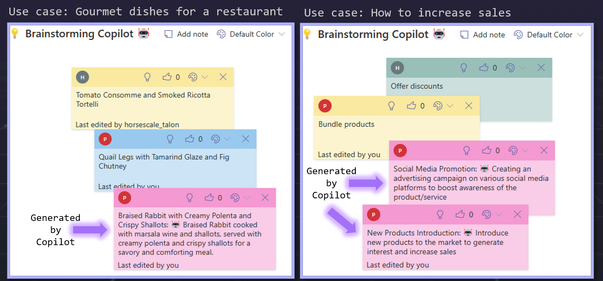

# 💡 Brainstorming Copilot 🤖

This sample uses the [Fluid Framework](https://fluidframework.com/) and OpenAI to deliver an AI-powered Brainstorming React App.
The App enables users to collaborate in real-time on a digital whiteboard 📝. When the user hit the lamp 💡 the existing ideas and some groundings are composed in a prompt and then the completion result is displayed so that the user can accept, tweak or retry.
Really intuitive and the possibilities are endless!

Azure API Management mediates and protects the OpenAI key and API's. Since it's a React App with client side components you don't want to call the OpenAI API directly to avoid exposing the key.

This sample is a fork from the brainstorm App available in the [Fluid Examples](https://github.com/Microsoft/FluidExamples) repo

## Quick start

Follow the steps below to run this in local mode (Azure local service):

1. Open a terminal and clone this repo: `git clone https://github.com/vieiraae/OpenAIBrainstorming`
2. `cd OpenAIBrainstorming`
3. Run `npm install` from the brainstorm folder root
4. Run `npm run start:server` to start the Azure local service for testing and development
5. In another terminal run `npm start` to start the client
6. If you get the `ERR_OSSL_EVP_UNSUPPORTED` error, set the following environment variable: `NODE_OPTIONS=--openssl-legacy-provider`
7. Navigate to `http://localhost:3000` in a browser tab
    - You'll be taken to a URL similar to `http://localhost:3000/**#1621961220840**` the path `#1621961220840` specifies one brainstorm document.
8. Simulate multiple users by navigating to the same URL in another window or tab
    - Add some note and then click in the lamp button to see the AI generated idea. Open the browser tab in developer mode to check debug information

Follow this [steps](https://github.com/microsoft/FluidExamples/blob/main/brainstorm/README.md#remote-mode) to configure in remote mode - connected to Azure Fluid Relay service 

## Planned improvements:
- Integrate with Azure AD for user authentication
